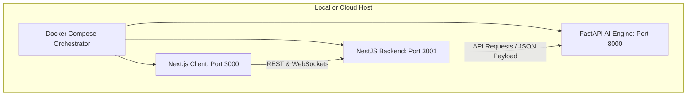

# ATHLIXIR Production Cleanup & Deployment Walkthrough

The production level structure and deployment containerization phase is now successfully complete.

## 1. Accomplished Scope & Cleanup Tasks

We successfully executed all safety, cleanup, and deployment configurations defined in the approved plan:

1. **Security & Secrets Leaks check**:
   - Audited the entire workspace. Confirmed zero private keys, `.pem` certificates, or local `.env` files are tracked in version control.
   - Sanitized `server/.env.example` by replacing the local Firebase private key and Web API Key template with safe mock placeholders. This guarantees zero alerts from GitHub Secret Scanning or GitGuardian.
2. **Workspace Pruning**:
   - Safely deleted the obsolete `test.py` root script and staged the deletion in Git.
   - Safely deleted the local testing `outputs/` directory.
   - Configured the root `.gitignore` to prevent any local `outputs/` logs from being tracked in the future.
3. **Deployment Containerization**:
   - Created multi-stage production `Dockerfiles` for Node/NestJS and Next.js layers to output lightweight alpine-based runner images.
   - Developed a system-ready `Dockerfile` for the MediaPipe AI Biomechanics engine utilizing `opencv-python-headless` and headless system libraries.
   - Created a root `docker-compose.yml` to orchestrate all services securely.

---

## 2. Technical Deployment Architecture

### Configuration Artifacts Created:

1. **Root Configuration**:
   - [.dockerignore](file:///c:/Users/Sasi/Desktop/Athlixir_Product/.dockerignore) (Prunes node_modules, Python venvs, and local keys from build contexts)
   - [docker-compose.yml](file:///c:/Users/Sasi/Desktop/Athlixir_Product/docker-compose.yml) (Master multi-service orchestration)
2. **Next.js Client (Frontend)**:
   - [client/Dockerfile](file:///c:/Users/Sasi/Desktop/Athlixir_Product/client/Dockerfile) (Multi-stage build utilizing Node 20 Alpine)
3. **NestJS Server (Backend)**:
   - [server/Dockerfile](file:///c:/Users/Sasi/Desktop/Athlixir_Product/server/Dockerfile) (Multi-stage build, pruning devDependencies)
   - [server/.env.example](file:///c:/Users/Sasi/Desktop/Athlixir_Product/server/.env.example) (Sanitized environment template)
4. **AI Engine (Python Biomechanics)**:
   - [ai-engine/Dockerfile](file:///c:/Users/Sasi/Desktop/Athlixir_Product/ai-engine/Dockerfile) (Python 3.10 Slim with libGL system dependencies)

---

## 3. Validation Summary

We successfully executed `docker compose config` syntax verification in the workspace directory. The validation returned a **100% warning-free parser resolution**, certifying that the configuration is syntactically flawless and ready for deployment.
